# Limit Order Book (C++)
[](https://github.com/nitant-p/order-book/actions/workflows/ci.yml)
[](https://github.com/nitant-p/order-book/actions/workflows/coverage.yml)

High-performance C++ matching engine and order book implementation for exchange-style trade simulation.

## Overview
This project implements a central limit order book (CLOB) with deterministic matching behavior, order lifecycle operations, and automated validation through unit tests and CI.

## Core Features
- Supports `BUY` and `SELL` sides.
- Supports `LIMIT`, `MARKET`, and `IOC` order types.
  - `LIMIT`: match immediately while prices cross; rest any remaining quantity.
  - `MARKET`: match available liquidity at the best prices; discard any unfilled remainder.
  - `IOC`: match immediately like a limit order; cancel any unfilled remainder instead of resting.
- Enforces price-time priority within price levels (FIFO queue per level).
- Multi-level matching across the book until fill or stop condition.
- Best-price execution:
  - Incoming buys match lowest available asks first.
  - Incoming sells match highest available bids first.
- Partial fill handling for both incoming and resting orders.
- Automatic cleanup of empty price levels after fills/cancels.
- Engine-managed monotonic `uint64_t` order IDs.
- Order lifecycle API includes:
  - `processOrder(side, type, price, quantity)`.
  - `cancelOrder(orderId)`.
  - `modifyOrder(orderId, newPrice, newQuantity)`.
- Trade capture per processed order (returns `std::vector<Trade>`).
- Dynamic memory pool for reusable `OrderNode` storage. This reduces hot-path allocation overhead while keeping active node pointers stable across pool growth.

## Architecture and Complexity
- Matching engine: [`MatchingEngine.h`](./include/MatchingEngine.h), [`MatchingEngine.cpp`](./src/MatchingEngine.cpp)
- Order model: [`Order.h`](./include/Order.h)
- Trade model: [`Trade.h`](./include/Trade.h)
- Test suite: `tests/` (category-based fixtures)

The engine owns two independent order books, one for bids and one for asks. The engine handles order processing, matching, cancellation, modification, trade capture, and ID-side routing. Each `OrderBookSide` owns its own price levels and borrows active order nodes from a shared `OrderNodePool`.

The shared pool will allocate Orders ahead of time and then provide the objects when needed. It will automatically double in size when capacity is full.



Each order book stores price levels in `std::map<int, PriceLevel>`. Conceptually this is an ordered binary tree keyed by price. A `PriceLevel` stores aggregate level metadata and points to the head and tail of its FIFO order-node queue.



Each order book also stores active orders by ID in `std::unordered_map<uint64_t, OrderNode*>`. The map indexes borrowed nodes; `OrderNodePool` owns the reusable node storage. The nodes link to each other as a doubly linked list, and each node points back to its `PriceLevel`.



### Operation Complexity
Let `P` be the number of price levels on one side of the book, `N` be the number of active orders, `D` be the requested depth size, and `M` be the number of resting orders matched by an incoming order.

| Operation | Average complexity | Notes |
| --- | ---: | --- |
| `OrderNodePool::acquire` / `release` | O(1) amortized | Growth initializes a new chunk, so a growth step is O(current capacity). |
| Order lookup by ID | O(1) | Uses `std::unordered_map`; worst case is O(N). |
| `bestPrice` | O(1) | Reads `begin()` or the last map entry. |
| `addOrder` | O(log P) | Finds or creates a price level, then appends to the FIFO list in O(1). |
| `deleteOrderById` / cancel | O(log P) | ID lookup and list unlink are O(1); empty-level cleanup touches the price map. |
| Partial quantity reduction | O(1) | Exact fill also deletes the order, so it becomes O(log P). |
| Same-price modify | O(1) | Queue-preserving reductions and same-level relinks avoid the price map. |
| Price-change modify | O(log P) | Removes from one level and finds or creates another. |
| `getBestOrder` | O(log P) | Current implementation resolves the best price, then looks up that level. |
| `getDepth(D)` | O(min(D, P)) | Walks price levels until the requested depth is filled. |
| `processOrder` | O(M log P) worst case | Each match consumes or updates one resting order; a remaining `LIMIT` add is O(log P). `MARKET` and `IOC` leftovers do not rest. |

### Dynamic Memory Pooling
`OrderNodePool` owns all `OrderNode` storage used by both sides of the book. `MatchingEngine` creates one shared pool, and each `OrderBookSide` borrows nodes from it when orders rest in the book.

The pool starts with the capacity passed to `MatchingEngine`. When all slots are active, it allocates another chunk and doubles total capacity. Existing chunks are never moved, so active `OrderNode*` pointers held by price levels and `orderNodesById_` remain valid after growth.

Cancels, exact fills, and deletes release nodes back to the pool. Released nodes have their links and `PriceLevel` pointer cleared before reuse, which prevents old queue state from leaking into later orders.

## Build
```bash
cmake -S . -B build -DBUILD_TESTING=ON
cmake --build build
```

Run executable:
```bash
./build/order_book
```

## Test
```bash
ctest --test-dir build --output-on-failure
```

## Test Categories
The suite is organized by behavior category:

- `BestMatchingBySideTest`: best-price matching and price-time behavior for buy/sell matching loops.
- `OrderTypeBehaviorTest`: limit, market, and IOC semantics plus liquidity edge cases.
- `CancelOrderTest`: cancel API behavior, queue cleanup, and non-mutation guarantees.
- `ModifyOrderTest`: modify API behavior, priority impacts, and invalid input handling.
- `OrderIdBehaviorTest`: engine-generated monotonic/unique order ID behavior.

Run a single category:
```bash
ctest --test-dir build -R ModifyOrderTest --output-on-failure
```

## Benchmarks
Google Benchmark coverage includes engine-level order processing, cancels, modifies, direct `OrderBookSide` mutations, best-order reads, and depth snapshots. The current V3 dynamic-pool implementation keeps reusable `OrderNode` storage in stable chunks, so active order pointers remain valid even when the pool grows.

Latest V3 results are in [`docs/benchmark_results_v3_dynamic_pool.csv`](./docs/benchmark_results_v3_dynamic_pool.csv), with charts in [`docs/benchmark_graphs_v3_dynamic_pool/`](./docs/benchmark_graphs_v3_dynamic_pool/). The full V1/V2/V3 benchmark history, commands, graphs, and comparison notes live in [`docs/benchmarks/README.md`](./docs/benchmarks/README.md).

Selected 10k V3 latencies:

| Case | ns/op |
| --- | ---: |
| MatchingEngine add-only `processOrder` | 80.6 |
| MatchingEngine `cancelOrder` | 63.8 |
| OrderBookSide `addOrder` | 47.6 |
| OrderBookSide exact-fill reduction | 34.3 |
| OrderBookSide same-price modify | 21.9 |

Against the original baseline, the dynamic pool keeps most of the pooling benefit, with about 27% mean latency improvement across the directly comparable V1 rows.

## CI/CD
- CI workflow: [`.github/workflows/ci.yml`](./.github/workflows/ci.yml)
- Coverage workflow: [`.github/workflows/coverage.yml`](./.github/workflows/coverage.yml)
- Runs on every push and pull request.
- Coverage artifacts (`.gcov` + summary) are uploaded in the Coverage workflow.
