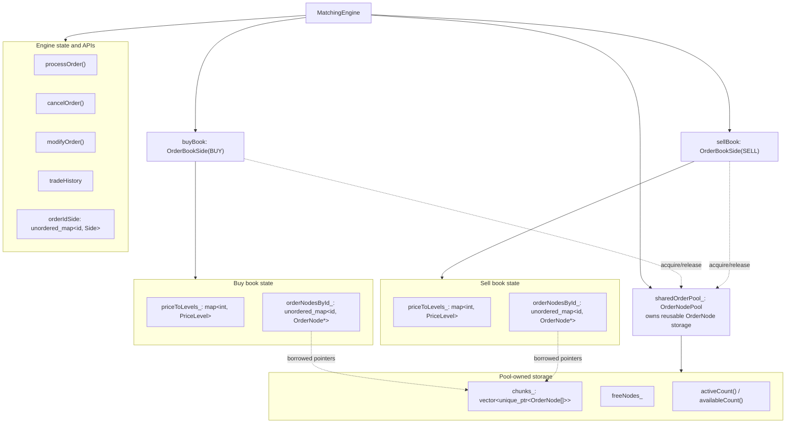
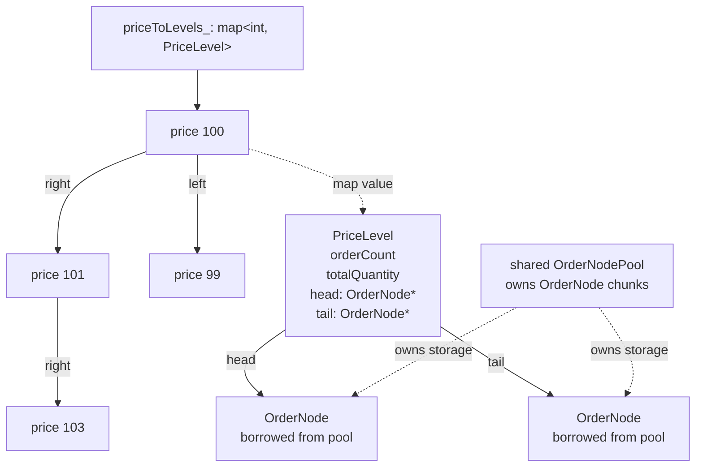
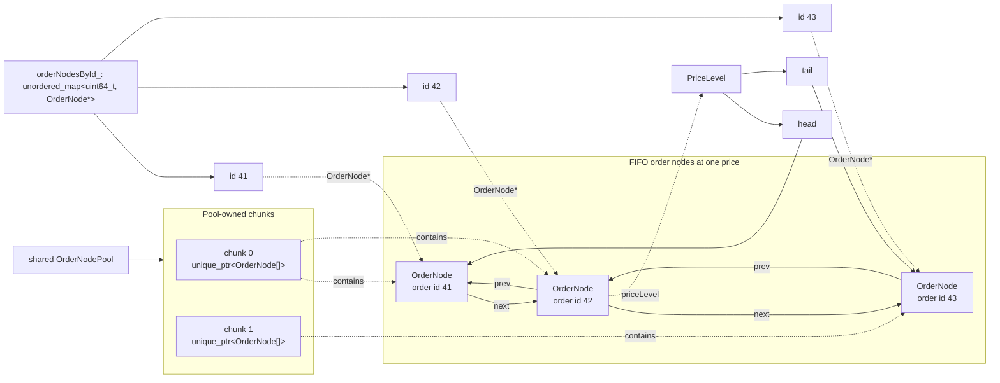

# Architecture Diagrams

This directory contains architecture diagrams used by the root README, plus Mermaid source files that can be rendered with Mermaid CLI when available.

## Matching Engine

The `MatchingEngine` owns one shared `OrderNodePool` and two `OrderBookSide` instances. The buy and sell books do not own order nodes; they borrow active `OrderNode*` slots from the shared pool and return them on cancel, fill, or delete paths.

## Price Levels

Each side stores price levels in `std::map<int, PriceLevel>`. Conceptually this is an ordered tree keyed by price. A `PriceLevel` stores aggregate metadata and head/tail pointers into the FIFO queue of borrowed pool nodes.

## Order Nodes

`orderNodesById_` is a lookup index of borrowed `OrderNode*` values. The nodes themselves live in pool chunks, link to neighboring active orders at the same price, and point back to their `PriceLevel`.

