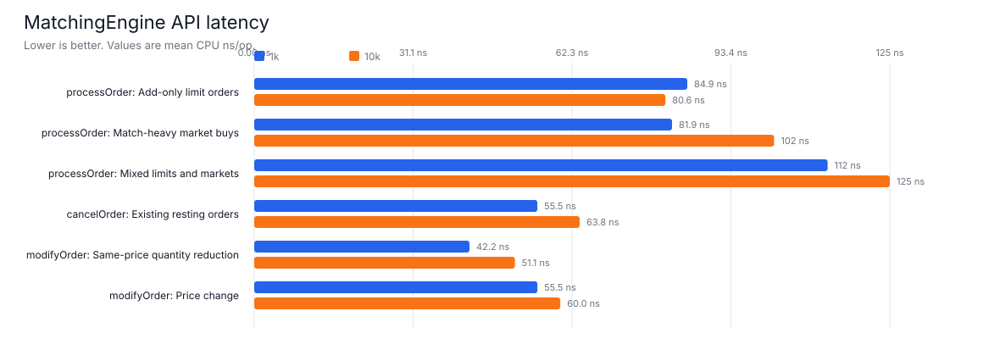
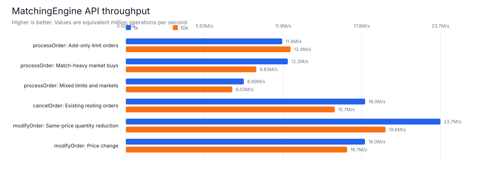
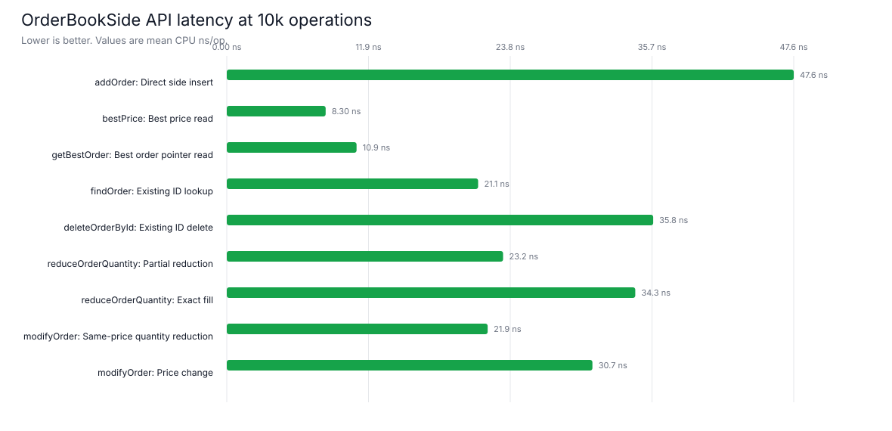
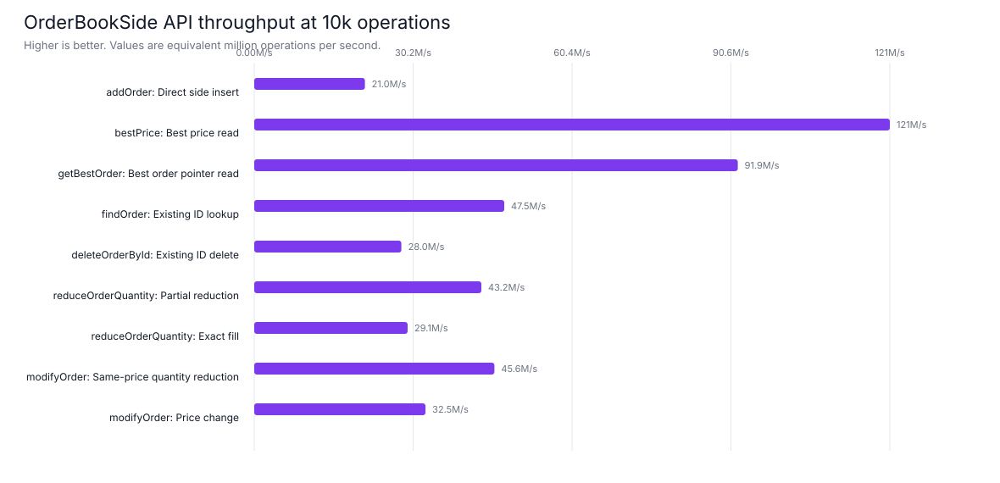
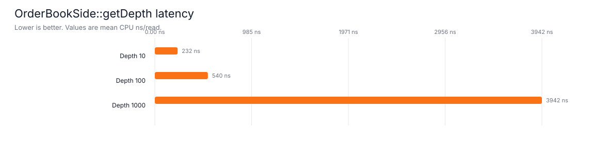
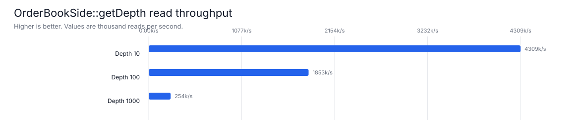

# Benchmark Results

This page keeps the benchmark history for the order book implementation. The root README links here for details and keeps only the current headline numbers.

## Running Benchmarks

Generate the V1 charts from the baseline CSV:

```bash
python3 scripts/generate_benchmark_graphs.py
```

Generate charts for another benchmark CSV:

```bash
python3 scripts/generate_benchmark_graphs.py docs/benchmark_results_v3_dynamic_pool.csv docs/benchmark_graphs_v3_dynamic_pool
```

Convert Google Benchmark JSON output to this repo's CSV format:

```bash
python3 scripts/benchmark_json_to_csv.py docs/benchmark_results_v3_dynamic_pool_raw.json docs/benchmark_results_v3_dynamic_pool.csv
```

Build and run the Google Benchmark executable:

```bash
cmake -S . -B build -DBUILD_TESTING=ON -DBUILD_GOOGLE_BENCHMARKS=ON -DCMAKE_BUILD_TYPE=Release
cmake --build build --target order_book_google_benchmark --parallel
./build/order_book_google_benchmark --benchmark_repetitions=3 --benchmark_report_aggregates_only=true
```

The benchmark build disables hot-path console logging with `ORDER_BOOK_DISABLE_LOGGING`, so `processOrder` and related timed paths are not dominated by `std::cout`.

## V1 Baseline

V1 results are in [`../benchmark_results_v1.csv`](../benchmark_results_v1.csv). Charts are generated into [`../benchmark_graphs/`](../benchmark_graphs/).

### MatchingEngine APIs


Findings:
- `processOrder` add-only still pays for node allocation and price-level map updates, but order-ID indexing is average O(1).
- Match-heavy `processOrder` remains competitive because market orders remove resting liquidity instead of growing the book.
- Mixed flow performs best among the engine order-processing cases because it combines passive adds with liquidity removal.
- `cancelOrder` benefits from average O(1) side-level order lookup before unlinking the node.
- Same-price `modifyOrder` is faster than price-change modify because it preserves queue position and avoids relinking across price levels.

### OrderBookSide APIs


Findings:
- Direct `OrderBookSide` calls are faster than equivalent `MatchingEngine` paths because they skip engine orchestration, trade handling, and side routing.
- `bestPrice` and `getBestOrder` are the cheapest read paths.
- `findOrder` is faster after moving `orderNodesById_` to `std::unordered_map`.
- Partial `reduceOrderQuantity` and same-price `modifyOrder` are the fastest write-style operations because the order stays in place.
- Exact-fill reduction is slower than partial reduction because it also removes the order node and may clean up the price level.
- Price-change modify is slower than same-price modify because it relinks the order into another level.

### Depth Snapshots


Findings:
- `getDepth(10)` is reasonable for shallow display-style snapshots.
- `getDepth(100)` scales up visibly because it walks more levels and writes more `LevelSnapshot` entries.
- `getDepth(1000)` is the slowest measured side API because it materializes a large snapshot vector.
- Depth benchmarks should be compared separately from order mutation benchmarks because they are read-heavy and allocation-sensitive.

## V2 Fixed Pool

V2 captures the fixed-capacity pooled-node implementation. Results are in [`../benchmark_results_v2_pool.csv`](../benchmark_results_v2_pool.csv), with raw Google Benchmark JSON in [`../benchmark_results_v2_pool_raw.json`](../benchmark_results_v2_pool_raw.json). Charts are generated into [`../benchmark_graphs_v2_pool/`](../benchmark_graphs_v2_pool/).

The pooled run used the same benchmark cases and capacities as the current benchmark executable: 1k, 10k, 100k, and 1M operations where defined, plus the existing depth snapshot sizes.

### MatchingEngine APIs


### OrderBookSide APIs


### Depth Snapshots


### Pooling Impact

Compared with the V1 CSV, the pooled implementation improves all common measured rows. Across the 33 directly comparable V1 rows, mean latency improved by about 29%.

Selected 10k comparisons:

| Case | V1 ns/op | Pooled ns/op | Improvement |
| --- | ---: | ---: | ---: |
| MatchingEngine add-only `processOrder` | 126.1 | 79.9 | 36.6% |
| MatchingEngine `cancelOrder` | 92.4 | 58.8 | 36.4% |
| OrderBookSide `addOrder` | 70.8 | 48.9 | 30.9% |
| OrderBookSide exact-fill reduction | 48.6 | 33.4 | 31.3% |
| OrderBookSide same-price modify | 38.2 | 24.0 | 37.2% |

The main benefit is that hot order lifecycle paths no longer repeatedly allocate and destroy individual `OrderNode` objects. Inserts acquire a preallocated slot, cancels and exact fills return the slot, and modifications keep the same node while relinking when needed. Read-heavy paths such as `bestPrice`, `getBestOrder`, and `getDepth` see smaller or indirect improvements because they are dominated by map traversal, pointer access, or snapshot construction rather than node allocation.

## V3 Dynamic Pool

V3 captures the dynamically growing pool implementation. Results are in [`../benchmark_results_v3_dynamic_pool.csv`](../benchmark_results_v3_dynamic_pool.csv), with raw Google Benchmark JSON in [`../benchmark_results_v3_dynamic_pool_raw.json`](../benchmark_results_v3_dynamic_pool_raw.json). Charts are generated into [`../benchmark_graphs_v3_dynamic_pool/`](../benchmark_graphs_v3_dynamic_pool/).

The dynamic run uses the same benchmark cases and operation sizes as V2. The benchmark-created pools still start with enough capacity for each case, so this measures the steady-state cost of the chunk-aware pool rather than repeated growth under pressure.

### MatchingEngine APIs





### OrderBookSide APIs





### Depth Snapshots





### Dynamic Pool Impact

Compared with the original V1 baseline, the dynamic pool keeps most of the pooling benefit: across the 33 rows directly comparable to V1, mean latency improved by about 27%. Compared with the fixed-capacity V2 pool, the dynamic version was roughly flat to slightly slower overall, averaging about 1.8% slower across the 63 comparable V2 rows. That small difference is the cost of chunk-aware ownership bookkeeping and an extra level of indirection in release/ownership checks.

Selected 10k comparisons:

| Case | V1 ns/op | V2 fixed pool ns/op | V3 dynamic pool ns/op | V3 vs V1 | V3 vs V2 |
| --- | ---: | ---: | ---: | ---: | ---: |
| MatchingEngine add-only `processOrder` | 126.1 | 79.9 | 80.6 | 36.1% faster | 0.9% slower |
| MatchingEngine `cancelOrder` | 92.4 | 58.8 | 63.8 | 31.0% faster | 8.5% slower |
| OrderBookSide `addOrder` | 70.8 | 48.9 | 47.6 | 32.8% faster | 2.7% faster |
| OrderBookSide exact-fill reduction | 48.6 | 33.4 | 34.3 | 29.4% faster | 2.7% slower |
| OrderBookSide same-price modify | 38.2 | 24.0 | 21.9 | 42.7% faster | 8.8% faster |
| OrderBookSide price-change modify | 47.5 | 33.4 | 30.7 | 35.4% faster | 8.1% faster |

The tradeoff is worthwhile if callers cannot confidently size the pool upfront: old node pointers remain valid because existing chunks are never moved, and the pool can grow without invalidating live orders. If the caller can always size exactly, the fixed-capacity pool remains the simpler and slightly more predictable steady-state design.
